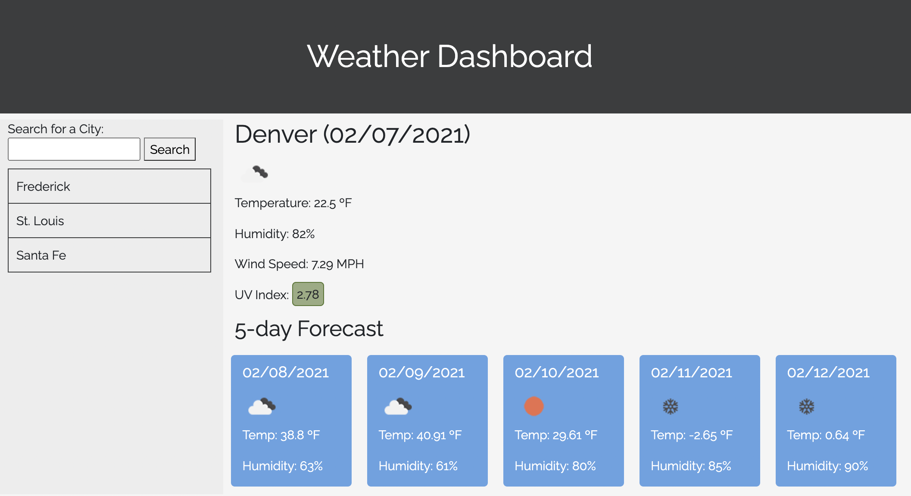

# Server-Side APIs: Weather Dashboard | Jenn Greiner

### Table of Contents:
* [Deployed Site](#deployed-site)
* [User Story](#user-story)
* [Description](#description)
* [Usage](#Usage)
* [Mock-Up](#Mock-Up)

## Deployed Site
[Weather Dashboard](https://jenngreiner.github.io/weather-dashboard-homework6/)

## User Story
As a traveler, I want to see the weather outlook for multiple cities so that I can plan a trip accordingly.

## Description 
Use the [OpenWeather API](https://openweathermap.org/api) to retrieve weather data for cities. The documentation includes a section called "How to start" that provides basic setup and usage instructions. You will use `localStorage` to store any persistent data.

## Usage
Open the [Weather Dashboard](https://jenngreiner.github.io/weather-dashboard-homework6/) in your browser. The weather for the Denver and the current date are displayed by default. Type in a city name in the search box to display the weather for that city. Your search history will be saved under the search bar, and you can click on a city name to see the weather for that city. 

## Mock-Up

The following image shows the weather dashboards's appearance and functionality:

## Installation
This application will run in any web browser.
​

## Credits
* [W3 Schools](https://www.w3schools.com/)
* [OpenWeather API](https://openweathermap.org/api)
* [MDN Web Docs](https://developer.mozilla.org/)
* [Bootstrap](https://getbootstrap.com/)

## License

- - -
